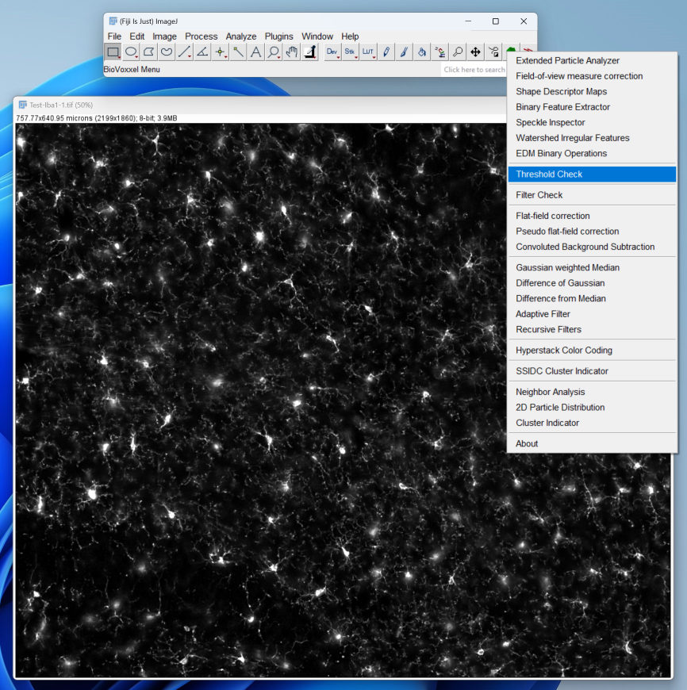
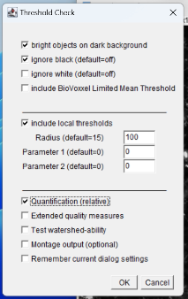

MicrogliaMorphology
================

#### *An ImageJ macro for microglia morphology analysis*

**Created**: 15 June, 2023 by Jenn Kim  
**Last updated**: 16 June, 2023

## Welcome to MicrogliaMorphology!

MicrogliaMorphology is a user-friendly ImageJ macro that offers a
semi-automated approach to characterize 27 morphology features from
hundreds to thousands of individual microglia cells.

#### If you are using this tool, please cite the following publications:

-   Insert manuscript link
-   [Quantifying Microglia Morphology from Photomicrographs of
    Immunohistochemistry Prepared Tissue Using
    ImageJ](https://www.jove.com/t/57648/quantifying-microglia-morphology-from-photomicrographs)

## Before you begin

### Install FIJI and plugins required for MicrogliaMorphology:

-   [FIJI/ImageJ](https://imagej.net/software/fiji/?Downloads)
-   [BioVoxxel Toolbox](https://imagej.net/plugins/biovoxxel-toolbox)
-   [FracLac](https://imagej.nih.gov/ij/plugins/fraclac/FLHelp/Installation.htm)

### Install MicrogliaMorphology into ImageJ plugins folder and download MicrogliaMorphology_BioVoxxel script

1.  Save the **MicrogliaMorphology.ijm** file from this repo into the
    ‘plugins’ folder in your ImageJ directory.
2.  Restart ImageJ
3.  MicrogliaMorphology should now appear under Plugins (at bottom of
    drop-down) in your ImageJ toolbar, where it can be clicked on to
    begin user prompts.
4.  Download **MicrogliaMorphology_BioVoxxel.ijm** file from this repo
    into your directory of choice.

### Create the following subdirectories in a single directory for your project, and include one representative test image:

### Some notes about MicrogliaMorphology

**Semi-automated workflow**: MicrogliaMorphology wraps around the ImageJ
plugins BioVoxxel Toolbox and FracLac, which are not compatible to call
to using the ImageJ macro language. As such, there are a few manual
steps in this protocol (Step 1, Step 6) which involve these 2 plugins.
The only other user input involves following prompts to select input
folders to call from and output folders to write to, with the option of
batch-processing input files for each step if desired. Otherwise, all
protocols, computation, and analysis described have been automated
within MicrogliaMorphology.

**Image preparation prior to MicrogliaMorphology**: When generating your
single-channel input .tiff images which contain the microglia you want
to analyze, include any important metadata tied to that image in its
title, with each descriptor separated by an underscore. For example:
“CohortName_AnimalID_Condition_Sex_BrainRegion.tiff” Formatting this way
is very important for compatibility with MicrogliaMorphologyR(insert
link) functions.

## Steps in MicrogliaMorphology

##### 1. Determine dataset-specific parameters to use in Steps 3-4

Determine thresholding parameters using BioVoxxel Toolbox plugin (user
input required)

1.  Run MicrogliaMorphology_BioVoxxel script: *Plugins > Macros > Run*
2.  Use **ThresholdCheck** feature within BioVoxxel Toolbox plugin to
    interactively determine the best thresholding parameters for your
    dataset. 
    -   Click/specify the following options in the pop-up box. A radius
        of 100 will typically work well for auto local thresholding
        microglia images, but you may need to run the ThresholdCheck a
        few times using different radius values to optimize the
        parameters to best capture fully connected, single microglia in
        your thresholded images. When ‘Quantification (relative)’ option
        is selected, the plugin will give you a recommended thresholding
        method at the end of the results file - this is a good starting
        point, but you should visually verify by looking through ALL of
        the threshold methods to determine which is best for your
        dataset: capturing as many branches as possible that are
        connected to cell bodies, while minimizing overlap between
        cells. You can read more about the ThresholdCheck feature on the
        [BioVoxxel
        website](https://imagej.net/plugins/biovoxxel-toolbox#threshold-check)
        and about [auto
        thresholding](https://imagej.net/plugins/auto-threshold)
        vs. [auto local
        thresholding](https://imagej.net/plugins/auto-local-threshold).
        **Make sure to note the final thresholding parameters you
        choose**. 
        

        ##### *MicrogliaMorphology begins here*

        

        

        Determine single-cell area range (user input required)
        

        In this step, you are determining the cutoff ranges (min and
        max) for what is considered a single microglia cell. Use the
        following guidelines when picking representative cells on both
        extremes:

-   **When selecting particles that are too small to be considered
    single cells:** select particles that you would consider *almost* as
    big as a single-cell, but not a single cell. **When selecting
    particles that are too big to be considered single cells:** select
    particles that you would consider as 2 obviously overlapping cells.
    

    ##### 2. Specify final thresholding and cell area parameters for your dataset

    ##### 3. Threshold images adapted from [standard protocol](https://www.jove.com/t/57648/quantifying-microglia-morphology-from-photomicrographs)

    ##### 4. Generate single-cell images

    ##### 5. Skeleton analysis

    ##### 6. FracLac analysis (user input required)

    

    

    Some important notes
    

    1.  Run FracLac plugin: *Plugins > Fractal Analysis > FracLac*
    2.  Select **BC** (box counting) in Fraclac GUI and select the
        following options (adapted from [Young et al.,
        2018](https://www.jove.com/t/57648/quantifying-microglia-morphology-from-photomicrographs),
        Section 5.5). **Make sure to select ‘lock black background’.**
        
    3.  Select **Batch** in Fraclac GUI and follow prompts. Load in
        files from the directory you wrote your single-cell images to in
        Step 4.

    

## Video Tutorial

-   insert video
