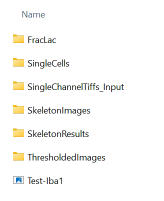
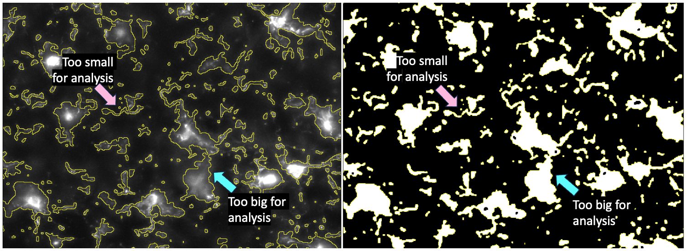
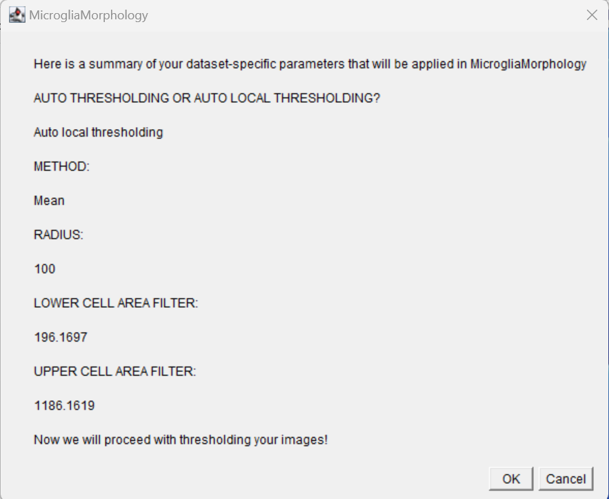

MicrogliaMorphology
================

#### *An ImageJ macro for microglia morphology analysis*

**Created**: 15 June, 2023 by Jenn Kim  
**Last updated**: 06 October, 2023

## Welcome to MicrogliaMorphology!

MicrogliaMorphology is a user-friendly ImageJ macro that offers a
semi-automated approach to characterize 27 morphology features from
hundreds to thousands of individual microglia cells.

#### If you are using this tool, please cite the following publications:

-   Insert manuscript link
-   [Quantifying Microglia Morphology from Photomicrographs of
    Immunohistochemistry Prepared Tissue Using
    ImageJ](https://www.jove.com/t/57648/quantifying-microglia-morphology-from-photomicrographs)

## Before you begin

### Install FIJI and plugins required for MicrogliaMorphology:

-   [FIJI/ImageJ](https://imagej.net/software/fiji/?Downloads)
-   [BioVoxxel Toolbox](https://imagej.net/plugins/biovoxxel-toolbox)
-   [FracLac](https://imagej.nih.gov/ij/plugins/fraclac/FLHelp/Installation.htm)

### Install MicrogliaMorphology into ImageJ plugins folder and download MicrogliaMorphology_BioVoxxel script

1.  When you download and install FIJI, your app and related
    scripts/plugins will be saved into a folder called “Fiji.app”.
    Create a new directory called “MicrogliaMorphology” under:
    Fiji.app > scripts > Plugins.
2.  Save the **MicrogliaMorphology_Program.ijm** and
    **MicrogliaMorphology_BioVoxxel.ijm**files from this repo (can be
    found in macros-scripts folder) into the new MicrogliaMorphology
    directory.
3.  Restart ImageJ
4.  MicrogliaMorphology should now appear under Plugins (at bottom of
    drop-down) in your ImageJ toolbar, under which you can find both
    macros that you just installed. Either can be clicked on to begin
    their respective user prompts.

### Create the following subdirectories in a single directory for your project where you would like to save your images and analysis output, and include one representative test image (e.g., ‘Test-Iba1’):

### Some notes about MicrogliaMorphology

**Semi-automated workflow**: MicrogliaMorphology wraps around the ImageJ
plugins BioVoxxel Toolbox and FracLac, which are not compatible to call
to using the ImageJ macro language. As such, there are a few manual
steps in this protocol (Step 1, Step 6) which involve these 2 plugins.
The only other user input involves following prompts to select input
folders to call from and output folders to write to, with the option of
batch-processing input files for each step if desired. Otherwise, all
protocols, computation, and analysis described have been automated
within MicrogliaMorphology.

**Image preparation prior to MicrogliaMorphology**: When generating your
single-channel input .tiff images which contain the microglia you want
to analyze, include any important metadata tied to that image in its
title, with each descriptor separated by an underscore. For example:
“CohortName_AnimalID_Condition_Sex_BrainRegion.tiff” Formatting this way
is very important for compatibility with
[MicrogliaMorphologyR](https://github.com/ciernialab/MicrogliaMorphologyR)
functions.

## Video Tutorial: How to use MicrogliaMorphology

Please watch this video before proceeding to the section below, which
contains details for specific steps which are meant to help guide you to
use the tool. Most of the detail is in the video, so it is important
that you watch this prior to beginning to use MicrogliaMorphology! -
insert video

## Steps in MicrogliaMorphology and how to navigate them

### 1. Determine dataset-specific parameters to use in Steps 3-4

Determine thresholding parameters using BioVoxxel Toolbox plugin (user
input required)

1.  Run MicrogliaMorphology_BioVoxxel script in ImageJ: *Plugins >
    MicrogliaMorphology > MicrogliaMorphology_BioxVoxxel*

2.  Use **ThresholdCheck** feature within BioVoxxel Toolbox plugin to
    interactively determine the best thresholding parameters for your
    dataset. 

    -   Click/specify the following options in the pop-up box.

    

    -   ThresholdCheck is a nifty tool that helps you decide which of
        the 16 auto thresholding and 9 auto local thresholding
        parameters within ImageJ are best suited for your image set.
        Auto thresholding takes into account the entire image space when
        binarizing to distinguish background from signal, while auto
        local thresholding only takes into account smaller parts of the
        image at a time using a defined radius. You can follow these
        links to read more about [auto
        thresholding](https://imagej.net/plugins/auto-threshold)
        vs. [auto local
        thresholding](https://imagej.net/plugins/auto-local-threshold).

    -   A radius of 100 will typically work well for auto local
        thresholding microglia images, but you may need to run the
        ThresholdCheck a few times using different radius values to
        optimize the parameters to best capture fully connected, single
        microglia in your thresholded images. When ‘Quantification
        (relative)’ option is selected, the plugin will give you a
        recommended thresholding method at the end of the results file -
        this is a good starting point, but you should visually verify by
        looking through ALL of the threshold methods to determine which
        is best for your dataset: capturing as many branches as possible
        that are connected to cell bodies, while minimizing overlap
        between cells. ThresholdCheck will give you a gallery of 25
        different thresholding settings on the image you input - each
        image is color coded accordingly - from the [BioVoxxel
        website](https://imagej.net/plugins/biovoxxel-toolbox#threshold-check),
        where you can find more information in the ThresholdCheck
        feature:

    

    -   Here are some examples of under, well, and over-thresholded
        microglia:

    

    -   **Make sure to note the final thresholding parameters you choose
        for your image set as you will need to input these choices into
        MicrogliaMorphology**.

#### *MicrogliaMorphology begins here*

MicrogliaMorphology will first prompt you to specify the thresholding
parameters that you decided on in Step 1 (which is why it is important
to write them down!):

Determine single-cell area range (user input required)

In this step, you are determining the cutoff ranges (min and max) for
what is considered a single microglia cell. Use the following guidelines
when picking representative cells on both extremes:

-   **When selecting particles that are too small to be considered
    single cells:** select particles that you would consider *almost* as
    big as a single-cell, but not a single cell.
    -   **When selecting particles that are too big to be considered
        single cells:** select particles that you would consider as 2
        obviously overlapping cells.
    -   Here are examples of particles that are too small or too big to
        be considered single cells: 

After you are done determining the lower and upper bounds for cell area,
MicrogliaMorphology will provide a summary of the final thresholding and
cell area parameters that will be applied in steps 2-4. You will see a
window like this pop up before moving on to step 2:

##### Steps 2-4 will use the final parameters that you specified within the macro such that the only user input required is to follow user prompts to specify folders to read from and write output to. You can consult the video of how to use MicrogliaMorphology at the start of this document for more information.

### 2. Threshold images adapted from [standard protocol](https://www.jove.com/t/57648/quantifying-microglia-morphology-from-photomicrographs)

### 3. Generate single-cell images

### 4. Skeleton analysis

### 5. FracLac analysis (user input required)

Some important notes

1.  Run FracLac plugin: *Plugins > Fractal Analysis > FracLac*
2.  Select **BC** (box counting) in Fraclac GUI and select the following
    options (adapted from [Young et al.,
    2018](https://www.jove.com/t/57648/quantifying-microglia-morphology-from-photomicrographs),
    Section 5.5). **Make sure to select ‘lock black background’.**
    
3.  Select **Batch** in Fraclac GUI and follow prompts. Load in files
    from the directory you wrote your single-cell images to in Step 4.
    

